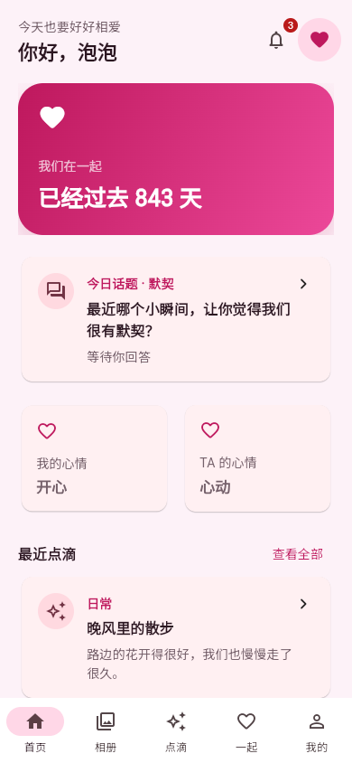
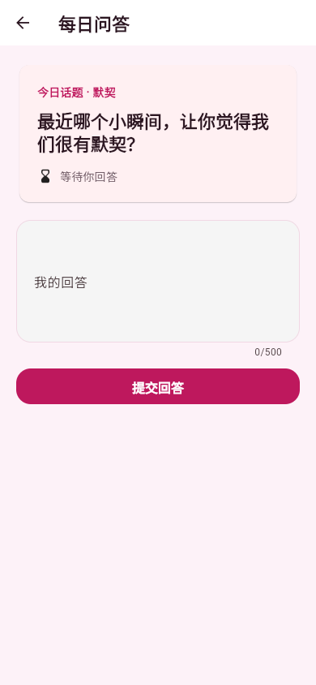
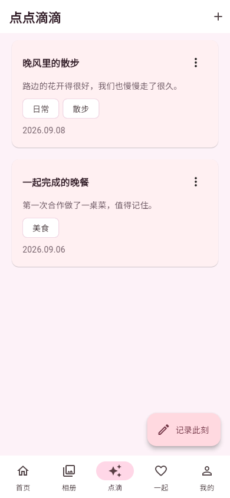
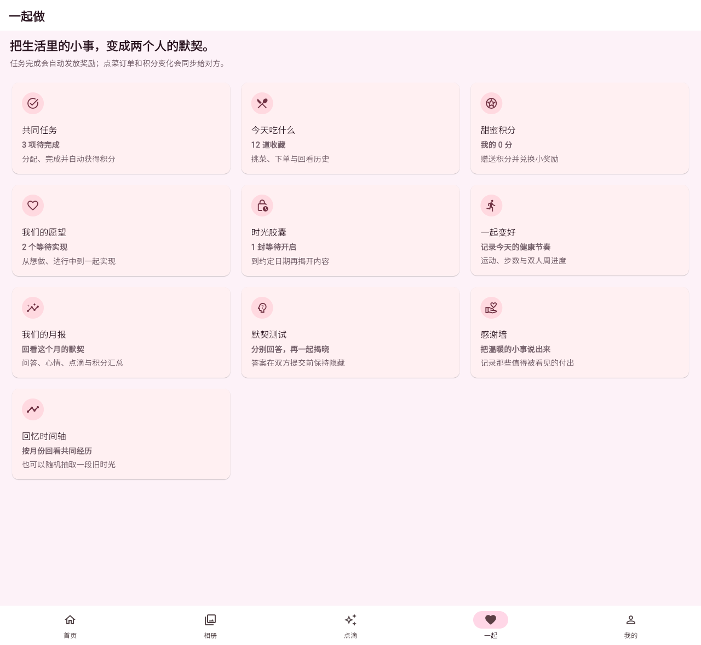

<div align="center">

# LoveSpace

**把两个人的日常，留在同一个空间。**

每日问答 · 共同回忆 · 生活计划


[界面预览](#界面预览) · [功能概览](#功能概览) · [技术栈](#技术栈) · [代码导航](#代码导航)

</div>

LoveSpace 是一款面向两位固定使用者的私密情侣应用。用一个问题开启今天，记录彼此的心情，收藏共同的照片，也一起安排下一顿饭、下一次旅行和想完成的小事。

Android 使用 Flutter 应用，iPhone 使用添加到主屏幕的 PWA。两端共享同一套业务数据；首页聚焦日常互动，其他生活工具集中在「一起」页。

## 界面预览

以下是实际运行的 Flutter Web 客户端截图，使用演示账号和模拟接口数据。手机尺寸为 **390 × 844**，不代表 Android 或 iPhone 真机验收结果。[查看截图说明](docs/screenshots/README.md)

<table>
  <tr>
    <th align="center">今天的我们</th>
    <th align="center">每日问答</th>
    <th align="center">点点滴滴</th>
  </tr>
  <tr>
    <td width="33%"></td>
    <td width="33%"></td>
    <td width="33%"></td>
  </tr>
  <tr>
    <td align="center">重要日期与彼此的近况</td>
    <td align="center">各自回答，再一起揭晓</td>
    <td align="center">把平凡的一天认真记下</td>
  </tr>
</table>

<details>
<summary>展开查看「一起做」宽屏界面</summary>

任务、菜单、积分、愿望、胶囊和回顾工具集中在同一页。下图为 **1280 × 1180** 浏览器视口的实际截图。



</details>

## 功能概览

| 场景 | 功能 | 可以一起做的事 |
| --- | --- | --- |
| 每天多了解一点 | 每日问答、默契测试、心情 | 分别作答后查看双方答案；记录今天的感受，选择仅自己或双方可见 |
| 留住共同回忆 | 相册、点滴、纪念日、感谢墙、时间轴 | 整理照片、写下带日期和标签的记录、记住重要日子，随机翻出一段旧时光 |
| 安排两个人的生活 | 任务、点菜、积分、愿望、时光胶囊 | 分配任务、选择菜品与规格、兑换小奖励、推进愿望，给未来留一封信 |
| 一起养成好习惯 | 健康目标、每日记录、双人挑战、周报、月报 | 记录各自的健康节奏，在允许的可见范围内查看彼此进度和阶段回顾 |

### 日常互动

- **每日问答**：各自提交答案，双方完成后揭晓；揭晓后的答案由服务端冻结。
- **心情记录**：支持每日记录、月历回顾和可见范围选择，私密心情不会向对方发送通知。
- **通知中心**：集中查看消息、标记已读，并跳转到相关业务页面。

### 共同回忆

- **相册与点滴**：管理相册、批量上传照片、收藏照片；点滴支持文字、最多九张图片、日期与标签。
- **纪念日**：记录累计天数与倒计时，支持重复日期和提醒设置。
- **感谢与期待**：在感谢墙记下温暖的小事，让愿望从「想做」走向「已实现」；时光胶囊在约定日期前隐藏正文与照片。

### 一起生活

- **任务与积分**：分配共同任务，完成后获得奖励；查看积分流水并自定义兑换项目。
- **今天吃什么**：维护菜品、分类和规格，挑选下单并查看订单记录。
- **健康与回顾**：记录目标和日常进度，参与双人挑战，通过周报与月报回看变化。

## 技术栈

| 层次 | 技术 | 职责 |
| --- | --- | --- |
| 客户端 | Flutter · Dart · Material 3 | Android 与 Web/PWA 界面，深浅色主题与响应式布局 |
| 路由与交互 | GoRouter · Image Picker | 页面导航、通知深链与图片选择 |
| 本地数据 | Shared Preferences · Flutter Secure Storage | 按账号保存部分最近内容与文字草稿；Android 安全保存登录凭据 |
| 服务端 | Java 21 · Spring Boot 3.5 · Spring Security | 业务接口、身份认证与双人空间权限校验 |
| 数据 | MySQL 8.4 · Flyway | 关系数据、事务和版本化数据库迁移 |
| 认证 | JWT · BCrypt · 一次性刷新令牌 | 密码验证、登录续期与会话撤销 |
| 图片 | S3 兼容对象存储 · 短期签名地址 | 私有图片存储与授权访问 |
| 通知 | 个推 · Web Push / VAPID · Transactional Outbox | Android 与 PWA 推送，投递重试与失效订阅处理 |
| 测试 | Flutter Test · JUnit · Mockito · Testcontainers | 客户端交互、服务端逻辑与 MySQL 集成验证 |

## 隐私与使用边界

LoveSpace 围绕一个双人空间设计，不开放公共注册或多人社区。服务端按成员身份校验数据访问，问答、心情和时光胶囊分别遵循自己的可见规则。

- Web 刷新令牌保存在 HttpOnly Cookie 中；Android 使用安全存储保存登录凭据。
- 支持修改密码和退出全部设备；并发登录续期使用 single-flight，减少重复刷新。
- 弱网下保留部分最近内容和文字草稿，不持久化待上传图片，也不提供完整离线编辑与自动合并。
- 系统推送受权限和操作系统后台策略影响；通知中心保留可回看的应用内消息。

## 代码导航

```text
app/
├── lib/core/          # 认证、网络、本地缓存与推送
├── lib/features/      # 按业务场景组织的页面、模型和接口
├── lib/theme/         # 主题与视觉样式
├── test/              # 客户端测试
├── android/           # Android 平台工程
└── web/               # PWA 清单与自定义 Service Worker

server/src/
├── main/java/         # 认证、业务、存储与通知服务
├── main/resources/    # 配置与 Flyway 迁移
└── test/java/         # 单元测试与集成测试

design-system/         # 设计规范
docs/screenshots/      # 实际界面截图与来源说明
```

本仓库维护 LoveSpace 独立版客户端与服务端。
