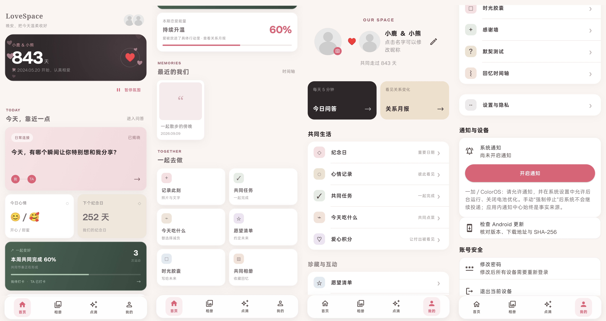

<div align="center">

# LoveSpace

**把两个人的日常，留在同一个空间。**

一个可自行部署的双人生活应用：从每天的一次问答，到值得珍藏的共同回忆。


[访问域名](https://love.paoooo.xyz) · [界面预览](#界面预览) · [设计亮点](#设计亮点) · [功能详解](#功能详解) · [快速开始](#快速开始) · [ECS 部署](#ecs-部署)

</div>

## 项目简介

LoveSpace 将「表达、记录、一起行动、回看变化」放进同一个私密空间。它既是一份双人日记，也是一组日常生活工具：分享今天的感受、整理照片、安排共同任务，或给未来的彼此留下一封信。

仓库包含 **Flutter 客户端和独立的 Spring Boot 服务端**。Android 使用原生 APK，Web 可作为 PWA 使用；iPhone 的使用路径是 Safari 添加到主屏幕，而非本仓库提供原生 iOS 安装包。服务端面向固定的两名使用者，不提供公开注册或公共社区。

## 界面预览



<p align="center"><sub>首页与个人中心的长图拼接预览 · 奶油色画布、玫瑰色点缀、柔和卡片层次</sub></p>

预览由项目维护者提供，展示当前界面风格。图中的昵称、日期与统计仅用于演示，不代表真实业务数据或生产环境验收；静态图片不呈现持续动效与滑动手感。[图片说明](docs/screenshots/README.md)

## 设计亮点

### 双人关系不只是两个账号

每日问答先独立作答，双方完成后才揭晓；共同任务区分执行对象，完成与奖励遵循权限规则；心情可以只留给自己，也可以分享给对方。功能围绕双人关系设计，同时保留各自的表达空间。

### 从今天的小事，到可以回看的共同经历

首页聚合问答、心情、纪念日、健康进度与近期回忆。记录不只停留在列表里：时间轴、周报和月报提供不同时间尺度的回看方式；任务奖励、积分兑换和愿望状态让共同计划有可见的进展。

### 有氛围，也有控制权

首页纪念卡与心情卡提供持续柔光和漂浮心形，触摸卡片有缩放回弹。氛围可以手动暂停，遵循系统移除动画设置，并在不可见或后台状态停止播放。四个主页面支持 **底部点击 + 左右滑动**，共享导航状态并保留各页状态；动态绘制层与文字布局分离。

### 将隐私落实到服务端返回的数据

未到期的时光胶囊不返回正文和照片；私密心情不会通知对方；问答通知不附带答案。访问权限、揭晓与解锁规则由服务端处理，而不是仅在客户端遮住内容。自部署让使用者可以管理自己的数据库和私有图片存储，但不等于端到端加密。

## 功能详解

### 日常连接：让交流自然发生

| 功能 | 实现与特点 |
| --- | --- |
| 每日问答 | 用一个问题开启交流，分别作答后共同揭晓；揭晓后由服务端冻结答案，保留当时的表达。 |
| 心情打卡 | 十种心情、文字记录、对方心情与月历回顾；支持「仅自己」和「双方可见」，表达与隐私可以同时存在。 |
| 默契测试 | 围绕同一个问题分别作答，在双方完成后查看结果，把交流变成轻量的双人互动。 |
| 感谢墙 | 专门留下被照顾、被理解的瞬间，让感谢有一个可持续积累的位置。 |

### 回忆收藏：不止保存一张照片

| 功能 | 实现与特点 |
| --- | --- |
| 共同相册 | 相册管理、批量选图上传与照片收藏；图片通过私有对象存储和短期签名地址访问。 |
| 点点滴滴 | 文字、日期、标签与最多九张图片共同描述一次经历，保留文字草稿以降低中断后的重写成本。 |
| 纪念日 | 相恋天数、重要日期倒计时、重复日期与提醒设置，将「已经走过多久」和「还有多久到来」放在一起。 |
| 回忆时间轴 | 按时间整理共同记录，也能随机回看，让旧日片段再次进入今天的生活。 |
| 时光胶囊 | 给未来写下标题、正文与照片；开启日前服务端只提供必要的外部信息，修改手机时间不能绕过解锁规则。 |

### 共同生活：让约定有进展

| 功能 | 实现与特点 |
| --- | --- |
| 共同任务 | 可指定「我、TA、双方」，按执行权限完成任务并发放积分；奖励去重避免重复操作多次计分。 |
| 今天吃什么 | 菜品、图片、分类、上下架、规格与加价选择，搭配点菜和订单记录，把反复讨论变成可复用的家庭菜单。 |
| 爱心积分 | 积分余额、流水和自定义兑换项目，让日常付出与小奖励之间有清楚的记录。 |
| 愿望清单 | 「想做 → 进行中 → 已实现」三阶段管理，从一个念头逐步走向共同完成的经历。 |

### 健康与回顾：关注日常节奏

- **健康记录与双人挑战**：设置目标、记录体重和运动等日常数据，在隐私规则允许的范围内了解彼此进度。
- **健康周报**：回看一周的健康记录与行动节奏，帮助安排下一步计划。
- **关系月报**：汇总双方可见的心情、问答、点滴与积分，提供月度回顾入口；这是基于记录的统计，不是 AI 情感诊断。
- **首页恋爱能量**：通过积分换算提供轻量反馈，不将这个数字包装成关系质量的客观评分。

### 通知、账号与设备

- 应用内通知中心支持已读管理和业务深链，消息可直接回到对应记录。
- Android 个推与 Web Push 按用户授权启用；服务端通过事务消息表、重试和失效订阅处理支持投递。
- 修改密码、退出当前设备及退出全部设备；修改密码会撤销已有会话。
- Android 更新入口核对版本、下载地址与 SHA-256；发布脚本生成签名包、校验值和更新清单。
- 设置页支持关系资料、邀请码、隐私说明和账号隔离的本地背景偏好。

## 技术架构

| 层次 | 技术与职责 |
| --- | --- |
| 客户端 | Flutter / Dart / Material 3：Android 与 Web/PWA 共用业务界面。 |
| 导航 | GoRouter + StatefulShellRoute + PageView：独立分支导航、滑动分页与状态保留。 |
| 本地数据 | Shared Preferences / Flutter Secure Storage：账号隔离缓存、文字草稿与 Android 登录凭据。 |
| 服务端 | Java 21 / Spring Boot 3.5 / Spring Security：业务接口、认证和双人空间权限校验。 |
| 数据库 | MySQL 8.4 / Flyway：关系数据、事务及版本化迁移。 |
| 认证 | JWT / BCrypt / 一次性刷新令牌：登录、续期与会话撤销；客户端合并并发刷新请求。 |
| 图片存储 | S3 兼容私有存储：授权上传与短期签名读取，可配置 OSS。 |
| 通知 | 个推 / Web Push / Transactional Outbox：业务事务写入消息，后台异步投递。 |
| 验证 | Flutter Test / JUnit / Mockito / Testcontainers：页面交互、业务逻辑及 MySQL 集成测试。 |

业务通过 `/api/v1/functions/{name}` 暴露兼容接口，认证和推送订阅使用独立端点。部分创建、订单与积分操作携带幂等请求标识，降低弱网重试带来的重复写入风险。

## 快速开始

### 1. 准备环境

- Flutter stable，配套 Dart **3.12.2 或更高兼容版本**；Android 调试还需 Android SDK 与已授权的 USB 调试设备。
- Java **21**；仓库包含 Maven Wrapper。
- Docker Compose，用于本地 MySQL **8.4** 和 S3Mock；也可按服务端配置接入已有依赖。

```sh
git clone https://github.com/PaoPao1021/Love-Space-Standalone-App.git
cd Love-Space-Standalone-App
```

### 2. 配置并启动服务端

在仓库根目录启动本地数据库与对象存储：

```sh
docker compose -f server/compose.yml up -d --wait
```

参照 [服务端文档](server/README.md#初始化两名账号) 和 [环境变量样例](server/.env.example)，通过一次性启动变量初始化两名账号。初始化完成后关闭引导开关并清除密码变量，再启动常驻服务：

```powershell
# Windows；macOS / Linux 使用 ./server/mvnw
./server/mvnw.cmd -f server/pom.xml spring-boot:run
```

默认 API 为 `http://127.0.0.1:8080`。Compose 仅启动本地 MySQL 与 S3Mock，不包含生产 TLS、备份或完整应用部署。

### 3. 运行客户端

另开终端，使用已连接的 Android 手机：

```sh
cd app
flutter pub get
adb reverse tcp:8080 tcp:8080
flutter devices
flutter run -d <设备ID> --dart-define=API_BASE_URL=http://127.0.0.1:8080
```

USB 调试期间保持连接；多设备时给 `adb` 增加 `-s <设备ID>`。Android 模拟器可改用 `http://10.0.2.2:8080`，局域网调试则填写电脑的实际 IP。

Web 开发预览：

```sh
flutter run -d chrome --dart-define=API_BASE_URL=http://127.0.0.1:8080
```

> `scripts/preview-ui.mjs` 是独立的模拟接口与静态页面预览工具，监听端口 4175。它不是真实后端，不会持久化业务数据，也不能用来验证上传、推送或双人同步。请勿将其部署为正式服务。

## ECS 部署

本项目采用 **阿里云 ECS 自托管**，维护者已为服务解析域名 **[love.paoooo.xyz](https://love.paoooo.xyz)**。访问使用预先初始化的双人账号，不提供公开注册或公共演示账号。

推荐由同一个 HTTPS 入口提供 Web/PWA 与 API，Android 也连接这一域名：

| 入口 | 地址 / 路由 | 服务 |
| --- | --- | --- |
| Web / PWA | `https://love.paoooo.xyz` | Flutter Web 静态资源，前端路由回退到 `index.html`。 |
| 业务 API | `https://love.paoooo.xyz/api/*` | 反向代理至 ECS 内部的 Spring Boot 服务。 |
| Android API 基址 | `https://love.paoooo.xyz` | 构建时注入，不附加 `/api`，接口路径由客户端拼接。 |

> 域名已解析是部署信息，不代表 HTTPS、服务健康或推送已完成验收。首次上线仍需检查 DNS 指向、安全组、证书及反向代理；不将 MySQL 或开发对象存储端口暴露到公网。

在 `app/` 构建生产 Web：

```powershell
flutter build web --release --pwa-strategy=none `
  --dart-define=API_BASE_URL=https://love.paoooo.xyz `
  --dart-define=VAPID_PUBLIC_KEY=<你的VAPID公钥>
```

在仓库根目录生成正式 Android 包（先配置仓库外签名密钥和 `app/android/key.properties`）：

```powershell
./scripts/build-android-release.ps1 `
  -ApiBaseUrl https://love.paoooo.xyz `
  -GetuiAppId <你的个推AppID> `
  -Version 1.0.0 -BuildNumber 1
```

将 `deploy/.env.production.example` 复制为不提交 Git 的 `deploy/.env.production`，设置 `LOVESPACE_DOMAIN=love.paoooo.xyz` 并填写其余生产参数，再按 [生产部署与验收文档](docs/production-deployment.md) 启动 ECS 上的服务。仓库提供 Caddy、应用与数据库的部署配置，以及备份脚本；私有 OSS/S3、认证密钥、推送凭据和备份策略需由部署者配置。iPhone 使用 Safari 打开该域名并添加到主屏幕，通知需在主屏幕 App 中由用户授权。

## 测试与发布

```sh
# 在 app/ 中
flutter analyze
flutter test
flutter build apk --debug --dart-define=API_BASE_URL=http://127.0.0.1:8080
```

```powershell
# 在仓库根目录；后端完整集成验证需要 Docker
./server/mvnw.cmd -f server/pom.xml test
```

正式发布前配置 HTTPS、私有对象存储、生产认证密钥、推送凭据和 Android 签名，不使用开发配置直接上线。

| 文档 / 工具 | 用途 |
| --- | --- |
| [客户端说明](app/README.md) | API 地址、PWA、Android 签名与构建参数。 |
| [服务端说明](server/README.md) | 账号初始化、配置、认证、推送及存储。 |
| [生产部署与验收](docs/production-deployment.md) | HTTPS、OSS、备份与 Android / iPhone 验收步骤。 |
| [Android 发布脚本](scripts/build-android-release.ps1) | 生成签名 APK、SHA-256 与静态更新清单。 |
| [前端移植记录](docs/frontend-reference-port.md) | 小程序来源、页面映射和平台适配背景。 |

## 隐私与使用边界

- **私密空间不等于端到端加密**：服务端仍负责处理数据，自部署者需保护数据库、存储、凭据与备份。
- **缓存不等于完整离线模式**：仅保留部分最近内容与文字草稿，不持久化待上传图片，不提供离线编辑自动合并。
- **系统推送不承诺必达**：权限、网络和厂商后台策略都会影响通知；强制停止应用后尤其如此，应用内通知中心仍是回看入口。
- **平台能力需分别验收**：Android 安装、Web 页面可用和 iPhone PWA 推送是不同的验证项，界面截图不能替代联调。

## 仓库结构

```text
app/                 Flutter 客户端、Android 工程与 Web/PWA
  lib/core/          认证、网络、缓存、推送
  lib/features/      业务页面、模型与仓库接口
  lib/theme/         主题、背景偏好与动态材质
  test/              客户端自动化测试
server/              Spring Boot 服务端、迁移与测试
deploy/              生产部署配置与备份脚本
scripts/             构建、预检、冒烟测试与模拟预览工具
docs/                部署说明、移植记录与唯一界面预览
design-system/       设计规范
```

## 参与改进

欢迎通过 [Issues](https://github.com/PaoPao1021/Love-Space-Standalone-App/issues) 提交问题或建议。请附上复现步骤、设备 / 系统、客户端版本以及脱敏后的日志；涉及权限、隐私或重复写入的改动，请同时补充服务端测试。提交界面改动时，建议说明窄屏、大字体、滑动导航与系统移除动画设置下的表现。

不要提交真实账号、密码、令牌、签名文件、存储密钥或私人照片。

## 来源与许可

独立版前端参考 [LoveSpace 小程序项目](https://github.com/PaoPao1021/LoveSpace) 的视觉与业务组织，并适配 Flutter、独立账号体系及 Java 服务端。具体映射见移植记录。

当前仓库未包含 `LICENSE` 文件，因此不在此声明 MIT、Apache 等开源授权。使用、修改或分发前，请向维护者确认授权范围，并遵守上游代码与第三方依赖各自的许可。
